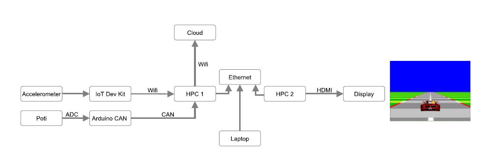

# IAVengers 

## Who we are
We are a team of IAV engineers

* Ali Khalil
* Christian Claus
* Engenji Glups
* Sascha Markwardt
* Thomas Lerch

## Play by Wire challenge

https://github.com/Eclipse-SDV-Hackathon-Chapter-Two/challenge-play-by-wire

We aim to develop a game that operates within a structure inspired by current vehicle electronics architecture, utilizing HPCs and computing boards. The game will integrate multiple Eclipse SDV and other open-source projects.

### What to do?

* Check whats delivered with the challenge
* Identify useful eclipse projects
* Design an architecture
* Get the needed HW components
* Understand the Eclipse SDV projects
* -> get it running ;)

### Useful eclipse projects

* Eclipse Kuksa: https://projects.eclipse.org/projects/automotive.kuksa
* Eclipse Ankaios: https://projects.eclipse.org/projects/automotive.ankaios
* Eclipse ThreadX: https://projects.eclipse.org/projects/iot.threadx

### Design an architecture

The basic idea for the architecture used in this project

### How we work

Branching strategy

Main -> The running code
Developer branch -> our workspace

## Details 

### Used IPs
Pi4 Wired: 192.168.0.1
Pi4 Hotspot: 192.168.1.1